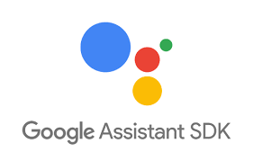

# Google-Assistant

Ce plugin est un add-on pour le framework [A.V.A.T.A.R](https://github.com/Spikharpax/A.V.A.T.A.R).

Intégrez un Assistant Google dans A.V.A.T.A.R

Nouvelle version 2.0, inclut les réponses vocales de l'assistant Google !

Un accès à de très nombreuses actions sans aucun développement :
- Vous voulez l'heure ou la météo de toutes les villes du monde ?
- Vous voulez des réponses sur "c'est qui ?", "c'est quoi ?", "c'est quand ?"
- Des jeux à plusieurs et à questions/réponses comme ciné quiz ou quiz musical ?
- Le résultat d'un calcul ?
- Connaître le restaurant le plus proche ?
- Des blagues à gogo ?
- Un Bot avec lequel discuter ?

Mais vous voulez peut-être aussi contrôler vos appareils connectés et sans développement ?
- Aucun problème, tous les appareils que vous pouvez connecter à l'assistant Google peuvent être aussi pilotés par ce plug-in. Connectez-le avec l'assistant Google, dictez les règles associés à l'appareil, c'est tout !

Les règles vocales associées aux appareils connectés de l'assistant Google sont trop limitées ?
- Ajoutez vos propres règles et vos propres réponses vocales (un exemple [içi](https://github.com/Spikharpax/Avatar-Plugin-Nest))!   

Vous voulez créer de véritables scénarios dans lesquels il y a une action d'un périphérique connecté accessible par l'assistant Google au milieu d'autres actions ?
- Aucun problème, Faites ce que vous voulez !

Entièrement compatible avec les plug-in [SonosPlayer](https://github.com/Spikharpax/Avatar-Plugin-SonosPlayer) et le [Client Android](https://github.com/Spikharpax/Avatar-Plugin-Android)

Et bien sûr, tout ça en gardant tout le potentiel d'A.V.A.T.A.R !

***
## ★ Installation

Vérifiez que vous avez les versions requises d'Avatar Serveur et Clients.

* Téléchargez le projet depuis la bibliothèque de plug-ins A.V.A.T.A.R 
Suivez la procédure de configuration dans la documentation disponible dans le plugin.

### Compatibilité
- [X] Avatar Serveur >= 3.4
- [X] Avatar Client >= 1.1 (Enceintes PC)
- [X] Avatar Client >= 1.2 (Enceintes Wifi avec plug-in SonosPlayer version >= 1.6)

***
## ★ Configuration et utilisation
* Ouvrez A.V.A.T.A.R Studio
* Cliquez sur l'icône du plug-in Google-Assistant
* Dans son menu déroulant, cliquez sur _Documentation_
  - Suivez la procédure de configuration

***
## ★ Historique
Version 2.0 (12-06-2020)
- Mise à jour du module Google-assistant
- Mise à jour du module grpc
- Ajout des réponses audio de l'assistant Google
- Refonte de l'intégration Sonos (audio en streaming)
- Refonte du plug-in pour gains de rapidité
- Mise à jour de la documentation

Version 1.2
- Ajout d'un listen dans la méthode init
- Ajout d'un répertoire assets pour une description et une image (Avatar 3.0)

Version 1.1
- Mise à jour mineure pour la compatibilité avec Avatar 3.0

Version 1.0
- Version Released

***
## ★ License
Logiciel libre sous [licence MIT](https://github.com/Spikharpax/A.V.A.T.A.R/blob/master/LICENSE)

Copyright (c) 2020 A.V.A.T.A.R - Stéphane Bascher
